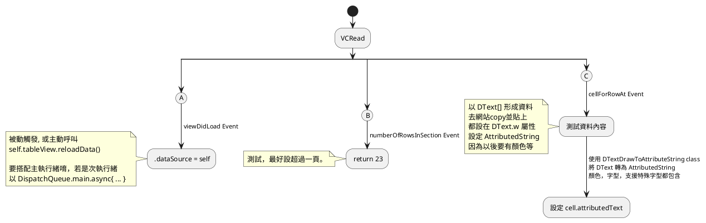
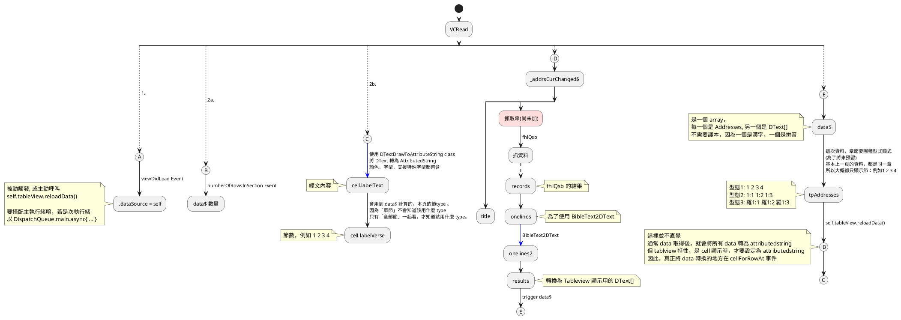

# uname

## 閱讀顯示

### tableview 基礎

- 繼承 UITableViewController
  - `class VCRead : UITableViewController`
- 設定 Main.storyboard 中的 VCRead

- 設定 .dataSource
  - 過載 tableView numberOfRowsInSection
  - 過載 tableView cellForRowAt

### 顯示v1

- 主要是 Tableview 使用
- 並且 DText[] 轉為 AttributedString 為主
  - 這個從 FHLBible 搬過來

## 顯示2
- 加入 data$, _addrsCurChanged$
  

