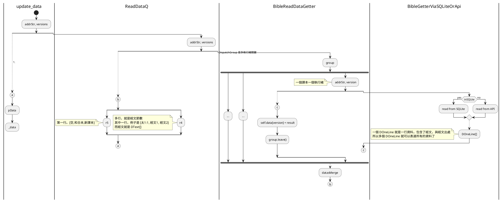

# VCRead 載入經文流程

## 目的

為了寫 BibleTW 專案，先了解以前的作法

## 流程

- dotted 點，是等待/非同步。
- 同步關鍵在 DispatchGroup 關鍵字。

```plantuml

@startuml
|update_data|
start
: addrStr, versions ;
split 
-[dotted]->1.;
(a)
: pData ;
: _data ;
-> trigger data changed ;
detach
split again
|ReadDataQ|
: addrStr, versions;
    split
        -[dotted]->
        (b)
        split 
        :r5;
        note: 第一行。[空,和合本,新譯本]
        split again
        :r4;
        note
        多行，就是經文節數
        其中一行，例子是 [太1:1, 經文1, 經文2]
        而經文就是 DText[]
        end note
        end split
        (a)
        detach
    split again
    |BibleReadDataGetter|
    -> DispatchGroup 是多執行緒關鍵 ;
    : group ;
    fork
        : ... ;
    fork again
        : ... ;
    fork again
        : addrStr, version;
        note 
        一個譯本一個執行緒
        end note
        split
            -[dotted]->;
            (c)
            : self.data[version] = result;
            : group.leave();
        split again

            |BibleGetterViaSQLiteOrApi|
            if (inSQLite) then (yes)
                : read from SQLite ;
            else (no)
                : read from API ;
            endif
            -[dotted]->;
            : DOneLine[] ;
            note
                一個 DOneLine 就是一行資料，包含了經文，與經文出處
                所以多個 DOneLine 就可以表達所有的資料了
            end note
    |BibleReadDataGetter|                        
            (c)
            detach
        end split
    end fork
    -[dotted]->;
    : datasMerge ;

    (b)
    detach
end split
end split
@enduml
```