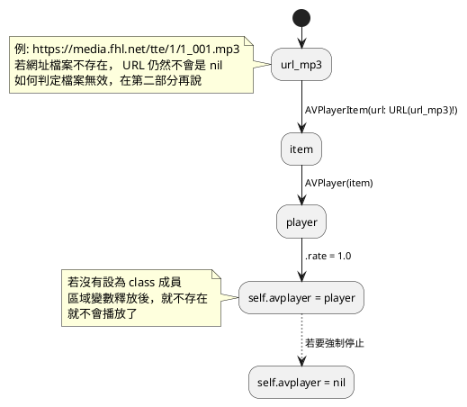
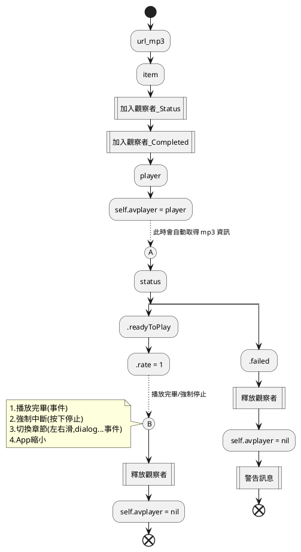

# 播放 mp3

## 播放 mp3 核心

### 流程



### 其它實驗

- 新的 avplayer 取代 self.avplayer 時
  - 舊的會停止，新的會開始
- 若有 2 個 self.avplayer 會如何？
  - 會同時播放，就是會很吵

### 小結

- 了解 AVPlayer 與 AVPlayerItem 與 URL 之間的關係
- .rate = 1 即是播放
- 一定要有 self.avplayer = player
- self.avplayer = nil 可強制停止

## 事件

### 前言

- 怎麼知道，url指向無效的檔案。
- 何時可以取得 mp3 的時間資訊。
- 播放完畢事件。
- app 縮小 (切換到別的程式) 事件。

### 流程2



```swift
var playerItemContext = 1
func addObserver_avplayitem_status(palyerItem: AVPlayerItem){
    palyerItem.addObserver(self, forKeyPath: #keyPath(AVPlayerItem.status), options: [.new, .old], context: &playerItemContext)
}
func removeObserver_avplayitem_status(palyerItem: AVPlayerItem){
    palyerItem.removeObserver(self, forKeyPath: #keyPath(AVPlayerItem.status), context: &playerItemContext)
}
func observeValue_playitem(forKeyPath keyPath: String?, of object: Any?, change: [NSKeyValueChangeKey : Any]?, context: UnsafeMutableRawPointer?){
    // 通常，一開始會是 0，變成 1
    // 發生在 初始一個 AVPlayer(item) 時會觸發，而不是 .rate = 1 才觸發
    
    assert( keyPath == "status" )
    if let change = change,
        let newValue = change[.newKey] as? Int,
        let oldValue = change[.oldKey] as? Int{
        
        let newStatus = AVPlayerItem.Status(rawValue: newValue)
        
        switch newStatus {
        case .readyToPlay: // 1
            print("readyToPlay")
            if let player = self.avPlayer,
                let item = player.currentItem {
                player.rate = 1.0
            }
            break
        case .unknown: // 0
            print("unknown")
            break
        case .failed:// 2
            // message box , 此章節尚無錄音
            let alertController = UIAlertController(title: "訊息", message: "此章節尚無錄音", preferredStyle: .alert)
            let okAction = UIAlertAction(title: "確定", style: .default) { (action) in
                // 點擊確定按鈕後的動作
            }
            alertController.addAction(okAction)
            self.present(alertController, animated: true, completion: nil)                                
            self.setPlayerNil()
            break
        default:
            print("default")
            break
        }
    }
}

var playerItemDidPlayToEndTimeObserver: Any?
func addObserver_avplayitem_completed(playerItem: AVPlayerItem){
    assert ( playerItemDidPlayToEndTimeObserver == nil )
    // 沒有把 回傳值 存起來 也會成功加入，但回傳值存起來，在 remove 時相對方便
    playerItemDidPlayToEndTimeObserver =
    NotificationCenter.default.addObserver(forName: .AVPlayerItemDidPlayToEndTime, object: playerItem, queue: .main) { [weak self] notification in
        self?.setPlayerNil()
    }
}
func removeObserver_avplayitem_completed(playerItem: AVPlayerItem){
    assert( playerItemDidPlayToEndTimeObserver != nil )
    NotificationCenter.default.removeObserver(playerItemDidPlayToEndTimeObserver!)
    playerItemDidPlayToEndTimeObserver = nil
}

func setPlayerNil(){
    if let player = self.avPlayer,
        let item = player.currentItem{
        removeObserver_avplayitem_status(palyerItem: item)
        removeObserver_avplayitem_completed(playerItem: item)
        player.rate = 0
        self.avPlayer = nil
    }
}
```
